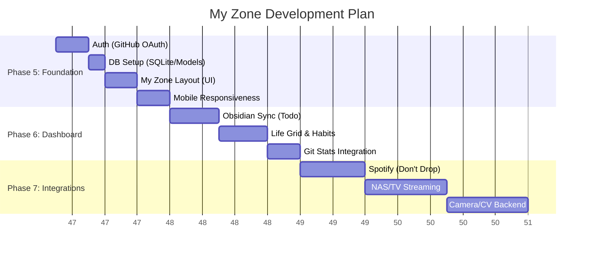

# Project Roadmap & Progress

This document tracks the evolution of `prabhanshu.space` from a static portfolio to a comprehensive "My Zone" personal dashboard.

## 📅 Development Timeline (Gantt)

---

## ✅ Completed Phases

### Phase 1-3: Core Infrastructure (Done)
- **VPS Setup**: Server provisioned, Docker installed, Nginx & SSL configured.
- **Base Website**: Portfolio content, "Data Scientist" profile, mobile text fixes.
- **Dev Environment**: Docker-based local development workflow.

### ⚠️ Phase 4: Continuous Deployment (Needs Debugging)
- **Step 4.1: GitHub Actions:** Workflow exists but has a history of failures (needs investigation).
- **Step 4.2: Automation:** Currently relying on manual `deploy` command until CI/CD is fixed.

---

## 🚧 Upcoming Phases

### Phase 5: My Zone Foundation & Auth
**Goal**: Secure access to a private area and establish the core UI structure.
- [ ] **Authentication**: Implement GitHub OAuth to allow login via Passkey (restricted to `prabhanshu11`).
- [ ] **Database**: Set up SQLite with FastHTML for user sessions and data persistence.
- [ ] **Layout Engine**: Create a "Switchable" UI (Dashboard Mode <-> TV Mode).
- [ ] **Mobile Polish**: Ensure Landing Page (Newsletter) and My Zone are fully responsive.

### Phase 6: The "Quantified Self" Dashboard
**Goal**: Visualize life metrics, habits, and tasks.
- [ ] **Financial Planning**: Simple tracking/projection view.
- [ ] **Daily Calendar**:
    - "Time Wasted" vs "Time Remaining" (until 12am).
    - **Obsidian Sync**: Parse Todo items from Syncthing-synced Vault.
- [ ] **Long-term View**:
    - "Life in Weeks" grid (visualize remaining weeks).
    - **Habit Streaks**: Calories, Steps, Protein, Ice Baths, etc.
    - **Git Stats**: Parse local `habit-tracker-git-commits` repo for push counts.
- [ ] **Personal Logs**:
    - Sleep/Wake times.
    - Morning/Evening routine checklists.
    - "Jerked Off" Tracker: Random mobile notifications/prompts for data entry.
- [ ] **Household**: Cooking, Dishes, Laundry/Office day tracker.

### Phase 7: Advanced Integrations
**Goal**: Connect physical world and media to the digital dashboard.
- [ ] **Spotify Integration**: Integrate `Programs/dont-drop-my-songs` for playlist management.
- [ ] **TV Mode**:
    - Interface for NAS media streaming.
    - Toggle button to switch between Dashboard/TV.
- [ ] **Computer Vision (Backend)**:
    - Integrate TP-Link Camera feed.
    - Develop backend service for object/activity recognition (Robotic control chain).

---

## 🧠 Strategic Notes (AI Thoughts)

1.  **Data Sync Strategy**: For Obsidian/Syncthing, we should mount the Syncthing folder as a read-only volume into the Docker container so the app can parse the markdown files directly.
2.  **Mobile First**: The "Jerked Off" tracker and Habit entry rely heavily on mobile usage. We need to ensure the input forms are extremely low-friction (big buttons, PWA-like feel).
3.  **Security**: Since "My Zone" contains personal financial and habit data, the GitHub OAuth check must be strict (allowlist only your ID).
4.  **Modular Architecture**: We should build the Dashboard widgets as separate FastHTML components so they can be easily reordered or hidden.
